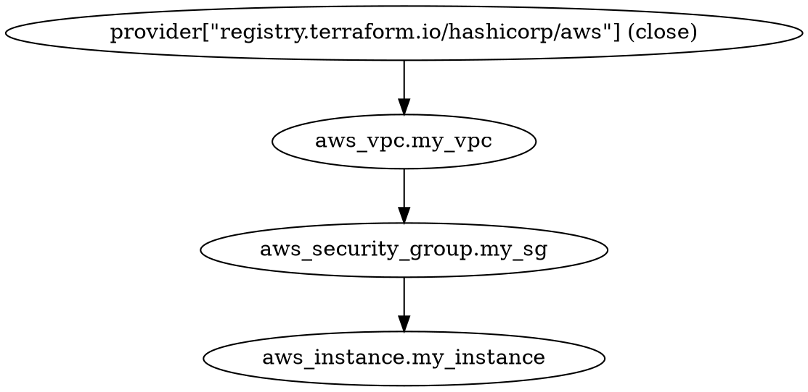

### **Terraform `graph` Command**

The `terraform graph` command generates a visual representation of the resources and dependencies in a Terraform configuration. It produces an output in [DOT format](https://graphviz.gitlab.io/), which can be used with tools like [Graphviz](https://www.graphviz.org/) to create graphical diagrams.

#### **Syntax**
```bash
terraform graph
```

#### **Key Uses**
- Helps visualize resource dependencies in a Terraform configuration.
- Useful for debugging complex Terraform configurations.
- Assists in understanding how resources interact.

---

### **Example: Visualizing an AWS Infrastructure**

#### **1. Terraform Configuration for AWS**
Let's create an AWS infrastructure that includes:
- A **VPC** (Virtual Private Cloud)
- An **EC2** instance
- A **Security Group**

#### **Terraform Code (`main.tf`)**
```hcl
provider "aws" {
  region = "us-east-1"
}

resource "aws_vpc" "my_vpc" {
  cidr_block = "10.0.0.0/16"
}

resource "aws_security_group" "my_sg" {
  vpc_id = aws_vpc.my_vpc.id

  ingress {
    from_port   = 22
    to_port     = 22
    protocol    = "tcp"
    cidr_blocks = ["0.0.0.0/0"]
  }
}

resource "aws_instance" "my_instance" {
  ami           = "ami-0c55b159cbfafe1f0"  # Example AMI for us-east-1
  instance_type = "t2.micro"
  vpc_security_group_ids = [aws_security_group.my_sg.id]

  tags = {
    Name = "Terraform-Instance"
  }
}
```

---

### **2. Running `terraform graph`**

Once you've written the Terraform code, run the following commands:

```bash
terraform init
terraform plan
terraform apply -auto-approve
terraform graph
```

This will output a DOT representation of the resource dependencies.

#### **Example Output (DOT Format)**


---

### **3. Visualizing the Graph**

To generate an actual graph, you can use **Graphviz**.

1. Install Graphviz (if not already installed):

   - **Linux/macOS**: 
     ```bash
     sudo apt install graphviz  # Ubuntu/Debian
     brew install graphviz      # macOS
     ```
   - **Windows**: Download and install from [Graphviz official site](https://graphviz.gitlab.io/download/).

2. Convert the output into a graphical image:

   ```bash
   terraform graph | dot -Tpng -o graph.png
   ```

   This generates a **graph.png** file, which shows the Terraform dependency graph.

---

### **4. Interpreting the Graph**
- **Nodes** represent Terraform resources and providers.
- **Edges (arrows)** show dependencies between resources.
- **Root Node** is the Terraform provider (AWS in this case).
- **Hierarchy** shows how one resource depends on another.

In our example:
- The `aws_instance` depends on `aws_security_group`.
- The `aws_security_group` depends on `aws_vpc`.
- The provider (`aws`) is at the root.

